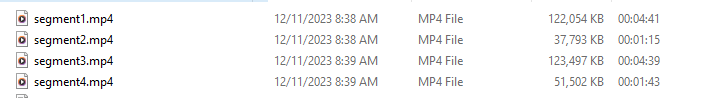

# "Top News Channel" - An Automated News Playout System (sourced by i-CABLE News)

A sophisticated automated news playout system that automatically collects news video streams from the i-CABLE News website (https://www.i-cable.com/), concatenantes them, and play it out through Open Broadcasting Software (OBS). The system can be run 24/7. Each news segment is 20 minutes long, with 4 four segments. The news streams are updated at every :20/:40/:60 of the hour. 

The backend of the system is implemented with Python. The automation is implemented with Jenkins and some shell scripting. Some various parts of on-air elements are implemented with simple HTML5/CSS3 scripting as browser sources. 

## Overview

The rationale of this project is to create a streaming system that automatically fetches, concatenates and play out the latest news streams from the Cable News API into editions of 20 minutes each, splitted into four segments. The goal is to build a automated continous streaming system that can be run 24/7 from just a single computer.

Demo Live Output (Click the thumbnail below to redirect to YouTube):

### Programme Rundown

| Minute of the Hour  | Programme |
| ------------- | ------------- |
| :00 - :06  | Segment 1: Regular News  |
| :06 - :07  | Break  |
| :07 - :09  | Segment 2: Sports News  |
| :09 - :10  | Break  |
| :10 - :16  | Segment 3: Regular News  |
| :16 - :17  | Break  |
| :17 - :19  | Segment 4: Sports News  |
| :19 - :20  | Break  (The latest video feeds will be re-fetched by the backend system)|
| :20 - :26  | Segment 1: Regular News  |
| :26 - :27  | Break  |
| :27 - :29  | Segment 2: Sports News  |
| :29 - :30  | Break  |
| :30 - :36  | Segment 3: Regular News  |
| :36 - :37  | Break  |
| :37 - :39  | Segment 4: Sports News  |
| :39 - :40  | Break  (The latest video feeds will be re-fetched by the backend system)|
| :40 - :46  | Segment 1: Regular News  |
| :46 - :47  | Break  |
| :47 - :49  | Segment 2: Sports News  |
| :49 - :50  | Break  |
| :50 - :56  | Segment 3: Regular News  |
| :56 - :57  | Break  |
| :57 - :59  | Segment 4: Sports News  |
| :59 - :00  | Break  (The latest video feeds will be re-fetched by the backend system)|

## Architecture

## Playout System

The playout system is maintained by "Open Broadcaster Software" (OBS). This project heavily utilizes the "Advanced Scene Switcher Plugin" (https://obsproject.com/forum/resources/advanced-scene-switcher.395/) which is an add-on for the software to allow users to program rundowns and conditions that automatically advances scenes, play video sources and modify on-air elements.

The OBS layout:

The Advanced Scene Switcher plugin:

## Backend Modules

### The Cable News API

Cable News maintains a RESTful API (https://www.i-cable.com/graphql) that allows their mobile app and website to perform HTTP POST queries to obtain a JSON response of the information of news items. This system utlizes this API to obtain a list of the latest news items, its title of the news item, the video stream link and the catagory name of the news item.

Example JSON output from the API:

### News Stream Module

The news stream module is implemented with Python. The script is activated by Jenkins at :18/:38/:58 of every hour (near the end of every edition in the programme rundown).

The logic:

1. Create 4 arrays: "segment1-4List" and variables: "segment1-4Length". The list arrays stores the m3u8 URLs of the video of the news items. The length array stores the total video length of the news segments. segment1List, segment3List stores video stream URLs of regular news items. segment2List, segment4List stores video stream URLs of sport news items. Their respective length variables represent the current total seconds of the videos in the list. 

2. Perform a HTTP POST to the Cable News API to get a list of the latest 50 news items except for items with Sports catagory.

3. Iterate through every category of the news item. 

4. Check if there is a video stream URL, if there is, get the length of the video item with ffprobe.

5. If segment1Length does not exceed the threshold time (270 seconds), append the URL to segment1List and accumulate the length to segment1Length; else, append the URL to segment3List and accumulate the length to segment3Length. If segment3Lenght exceeds the threshold length too, break out of the loop function.

6. Perform a HTTP POST to the Cable News API to get a list of the latest 50 sports news items.

7. Check if there is a video stream URL, if there is, get the length of the video item with ffprobe.

8. If segment2Length does not exceed the threshold time (40 seconds), append the URL to segment2List and accumulate the length to segment2Length; else, append the URL to segment4List and accumulate the length to segment4Length. If segment4Length exceeds the threshold length too, break out of the loop function.

9. Download all video URLS and merge them into one single .ts video with ffmpeg in each of the array "segment1-4List". Modify the file "MCRCurrentlyPlaying.txt" to let the playout system know the video files are being updated.

10. Save the files "segment1-4.mp4" in the file server for the playout system to play it out. Modify the file "MCRCurrentlyPlaying.txt" to let the playout system the videos are ready to be played.

These files are the output from the News Stream module. The playout system plays these files automatically according to the programme rundown above.

### News Ticker Module

The news ticker module is implemented with Python. The script is polled at every 5 minutes with Jenkins.

The news ticker queries the latest 30 headlines from the Cable News website. A "headline" refers to news article titles on the website.

The first 14 headlines are general news headlines.

The next 8 headlines are international news and mainland news headlines. (Articles that has the category "中國在線" and "兩岸國際")

The last 9 headlines are sport headlines (Articles that has the category "體育")

Example output from the Jenkin's console:

These headlines will be written to a file called "NewsTicker.txt" in the file system. The playout system of OBS will read these files and render the news ticker on the screen and update immediately if the file gets updated.

### Weather Widget Module

The weather widget module queries the latest weather warnings and forecast icons, temperature and humidity from the weather API from the Hong Kong Observatory:

https://www.hko.gov.hk/en/weatherAPI/doc/files/HKO_Open_Data_API_Documentation.pdf

The module is implemented with Python and is polled by Jenkins server every 5 minutes.

The current system allows a maximum of 6 weather icons. The first weather icons is the "forecast" icon, which is the forecast ID returned from the HKO API representing the weather forecast conditions. The other 5 weather icons are weather warning icons. If 6 weather icon slots cannot be fully utilized, the script will replace it with a blank image. 

The files outputted by the weather widget module:

## Others

### Finance Widget

The finance widget is a HTML file that includes HTML5, CSS3 and JavaScript elements. This HTML file allows OBS to take it as a browser source. The HTML file rotates various stock indices queried from the Yahoo Finance URL every 5 minutes.

Depending on the time of the day, different stock indices will be cycled:

| Time of Day  | Stock Indices | Stock Label
| ------------- | ------------- | ------------- |
| 0000 - 0759  | "道指", "標普", "富時", "CAC", "現貨金"  | '^DJI', '^GSPC', '^FTSE', '^FCHI', 'GC=F' |
| 0800 - 0929  | "道指", "標普", "日本", "現貨金"  | '^DJI', '^GSPC', '^N225', 'GC=F' |
| 0930 - 1629  | "恆指", "滬深", "上證", "現貨金"  | '^HSI', '000300.SS', '000001.SS', 'GC=F' |
| 1630 - 1659  | "恆指", "富時", "CAC", "現貨金" | '^HSI', '^FTSE', '^FCHI', 'GC=F' |
| 1700 - 2129  | "富時", "CAC", "現貨金" | '^FTSE', '^FCHI', 'GC=F' |
| 2130 - 2359  | "道指", "標普", "富時", "CAC", "現貨金"  | '^DJI', '^GSPC', '^FTSE', '^FCHI', 'GC=F' |
